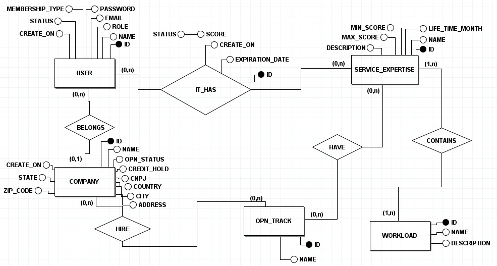

# Database Documentation

# 1. Overview

# 2. Data Model

## 2.1 Tables

### Table user
- **id**
  - Type: bigint unsigned
  - Description: Unique identifier of the user.
- **email**
  - Type: varchar(50)
  - Description: User's email.
- **password**
  - Type: varchar(100)
  - Description: User's password.
- **name**
  - Type: varchar(50)
  - Description: User's name.
- **role**
  - Type: enum('ADM', 'USER')
  - Description: User's role in the system (administrator or user).
- **membership_type**
  - Type: enum('PRINCIPAL', 'WORLDWIDE')
  - Description: User's membership type (principal or worldwide).
- **ingestion_operation**
  - Type: enum('CSV', 'MANUAL')
  - Description: Data ingestion method used to save the user.
- **status**
  - Type: enum('ACTIVE', 'INACTIVE')
  - Description: User's account status (active or inactive).
- **created_at**
  - Type: timestamp
  - Description: Date and time when the record was created.
- **updated_at**
  - Type: timestamp
  - Description: Date and time of the last update to the record.
- primary key (id)

### Table company
- **id**
  - Type: bigint unsigned
  - Description: Unique identifier of the company.
- **name**
  - Type: varchar(50)
  - Description: Company's name.
- **slogan**
  - Type: varchar(200)
  - Description: Company's slogan.
- **credit_hold**
  - Type: varchar(40)
  - Description: Credit hold information.
- **cnpj**
  - Type: varchar(150)
  - Description: Company's CNPJ.
- **country**
  - Type: varchar(20)
  - Description: Company's country.
- **state**
  - Type: varchar(50)
  - Description: Company's state.
- **city**
  - Type: varchar(100)
  - Description: Company's city.
- **address**
  - Type: varchar(200)
  - Description: Company's address.
- **opn_status**
  - Type: enum('MEMBER', 'EXPIRED','INACTIVE')
  - Description: Company's status in the system.
- **ingestion_operation**
  - Type: enum('CSV', 'MANUAL')
  - Description: Data ingestion method used to save the company.
- **company_status**
  - Type: enum('ACTIVE', 'INACTIVE')
  - Description: Company's status (active or inactive).
- **created_at**
  - Type: timestamp
  - Description: Date and time when the record was created.
- **updated_at**
  - Type: timestamp
  - Description: Date and time of the last update to the record.
- primary key (id)

### Table workload
- **id**
  - Type: bigint unsigned
  - Description: Unique identifier of the workload.
- **name**
  - Type: varchar(100)
  - Description: Name of the workload.
- **description**
  - Type: varchar(250)
  - Description: Description of the workload.
- **ingestion_operation**
  - Type: enum('CSV', 'MANUAL')
  - Description: Data ingestion method used to save the workload.
- **status**
  - Type: enum('ACTIVE', 'INACTIVE')
  - Description: Workload's status (active or inactive).
- **created_at**
  - Type: timestamp
  - Description: Date and time when the record was created.
- **updated_at**
  - Type: timestamp
  - Description: Date and time of the last update to the record.
- primary key (id)

### Table service_expertise
- **id**
  - Type: bigint unsigned
  - Description: Unique identifier of the expertise.
- **name**
  - Type: varchar(100)
  - Description: Name of the expertise.
- **description**
  - Type: varchar(250)
  - Description: Description of the expertise.
- **life_time_month**
  - Type: int
  - Description: How many months this expertise is valid for.
- **ingestion_operation**
  - Type: enum('CSV', 'MANUAL')
  - Description: Data ingestion method used to save the expertise.
- **status**
  - Type: enum('ACTIVE', 'INACTIVE')
  - Description: Expertise's status (active or inactive).
- **created_at**
  - Type: timestamp
  - Description: Date and time when the record was created.
- **updated_at**
  - Type: timestamp
  - Description: Date and time of the last update to the record.
- primary key (id)

### Table opn_track
- **id**
  - Type: bigint unsigned
  - Description: Unique identifier of the opn track.
- **name**
  - Type: varchar(50)
  - Description: Name of the opn track.
- **ingestion_operation**
  - Type: enum('CSV', 'MANUAL')
  - Description: Data ingestion method used to save the opn track.
- **status**
  - Type: enum('ACTIVE', 'INACTIVE')
  - Description: Opn track's status (active or inactive).
- **created_at**
  - Type: timestamp
  - Description: Date and time when the record was created.
- **updated_at**
  - Type: timestamp
  - Description: Date and time of the last update to the record.
- primary key (id)

## 2.2 Table Relationships

### Table company_and_user
- **company_id**
  - Type: bigint unsigned
  - Description: Foreign key referencing the company table by ID.
- **user_id**
  - Type: bigint unsigned
  - Description: Foreign key referencing the user table by ID.

### Table company_and_opn_track
- **company_id**
  - Type: bigint unsigned
  - Description: Foreign key referencing the company table by ID.
- **opn_track_id**
  - Type: bigint unsigned
  - Description: Foreign key referencing the opn_track table by ID.

### Table company_and_workload
- **company_id**
  - Type: bigint unsigned
  - Description: Foreign key referencing the company table by ID.
- **workload_id**
  - Type: bigint unsigned
  - Description: Foreign key referencing the workload table by ID.
- **score**
  - Type: numeric(3,2)
  - Description: Percentage of the workload completed by the company.
- **status**
  - Type: enum('PASSED', 'IN PROGRESS', 'EXPIRED')
  - Description: Status to track the progress of the workload.
- **created_at**
  - Type: timestamp
  - Description: Date and time when the record was created.
- **expiration_date**
  - Type: timestamp
  - Description: Expiration date of the relationship between the company and the workload.

### Table opn_track_and_expertise
- **opn_track_id**
  - Type: bigint unsigned
  - Description: Foreign key referencing the opn_track table by ID.
- **expertise_id**
  - Type: bigint unsigned
  - Description: Foreign key referencing the service_expertise table by ID.

### Table workload_and_expertise
- **workload_id**
  - Type: bigint unsigned
  - Description: Foreign key referencing the workload table by ID.
- **expertise_id**
  - Type: bigint unsigned
  - Description: Foreign key referencing the service_expertise table by ID.

# 3. Diagram

