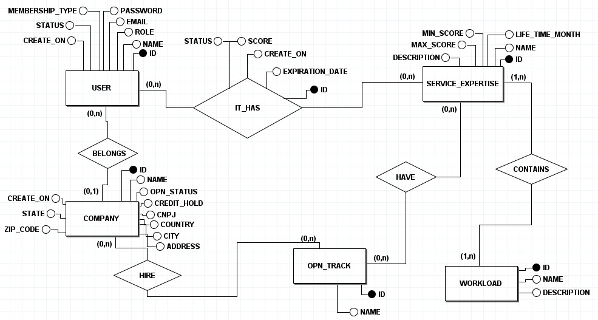

# Documentação do banco de dados

# 1. Visão Geral
Este banco de dados está sendo usado na API da FATEC do 4° Semestre. 
Utilizamos um script DDL para criar o banco antes de executar o script Java, 
assim garantimos que a qualidade do script SQL seja a melhor possível.

# 2. Modelo de Dados

## 2.1 Tabelas

### Tabela user
- **id**
  - Tipo: bigint unsigned
  - Descrição: Identificador único do usuário.
- **email**
  - Tipo: varchar(50)
  - Descrição: Email do usuário.
- **password**
  - Tipo: varchar(100)
  - Descrição: Senha do usuário.
- **name**
  - Tipo: varchar(50)
  - Descrição: Nome do usuário.
- **role**
  - Tipo: enum('ADM', 'USER')
  - Descrição: Papel do usuário no sistema (administrador ou usuário).
- **membership_type**
  - Tipo: enum('PRINCIPAL', 'WORLDWIDE')
  - Descrição: Tipo de adesão do usuário (principal ou global).
- **ingestion_operation**
  - Tipo: enum('CSV', 'MANUAL')
  - Descrição: Método de ingestão de dados que foi usado para salvar o usuário.
- **status**
  - Tipo: enum('ACTIVE', 'INACTIVE')
  - Descrição: Status da conta do usuário (ativo ou inativo).
- **created_at**
  - Tipo: timestamp
  - Descrição: Data e hora de criação do registro.
- **updated_at**
  - Tipo: timestamp
  - Descrição: Data e hora da última atualização do registro.
- primary key (id)

### Tabela company
- **id**
  - Tipo: bigint unsigned
  - Descrição: Identificador único da empresa.
- **name**
  - Tipo: varchar(50)
  - Descrição: Nome da empresa.
- **slogan**
  - Tipo: varchar(200)
  - Descrição: Slogan da empresa.
- **credit_hold**
  - Tipo: varchar(40)
  - Descrição: Informação sobre crédito.
- **cnpj**
  - Tipo: varchar(150)
  - Descrição: CNPJ da empresa.
- **country**
  - Tipo: varchar(20)
  - Descrição: País da empresa.
- **state**
  - Tipo: varchar(50)
  - Descrição: Estado da empresa.
- **city**
  - Tipo: varchar(100)
  - Descrição: Cidade da empresa.
- **address**
  - Tipo: varchar(200)
  - Descrição: Endereço da empresa.
- **opn_status**
  - Tipo: enum('MEMBER', 'EXPIRED','INACTIVE')
  - Descrição: Status da empresa no sistema.
- **ingestion_operation**
  - Tipo: enum('CSV', 'MANUAL')
  - Descrição: Método de ingestão de dados que foi usado para salvar a empresa.
- **company_status**
  - Tipo: enum('ACTIVE', 'INACTIVE')
  - Descrição: Status da empresa (ativo ou inativo).
- **created_at**
  - Tipo: timestamp
  - Descrição: Data e hora de criação do registro.
- **updated_at**
  - Tipo: timestamp
  - Descrição: Data e hora da última atualização do registro.
- primary key (id)

### Tabela workload
- **id**
  - Tipo: bigint unsigned
  - Descrição: Identificador único da carga de trabalho.
- **name**
  - Tipo: varchar(100)
  - Descrição: Nome da workload.
- **description**
  - Tipo: varchar(250)
  - Descrição: Descrição da workload.
- **ingestion_operation**
  - Tipo: enum('CSV', 'MANUAL')
  - Descrição: Método de ingestão de dados que foi usado para salvar a workload.
- **status**
  - Tipo: enum('ACTIVE', 'INACTIVE')
  - Descrição: Status da workload (ativo ou inativo).
- **created_at**
  - Tipo: timestamp
  - Descrição: Data e hora de criação do registro.
- **updated_at**
  - Tipo: timestamp
  - Descrição: Data e hora da última atualização do registro.
- primary key (id)

### Tabela service_expertise
- **id**
  - Tipo: bigint unsigned
  - Descrição: Identificador único da expertise.
- **name**
  - Tipo: varchar(100)
  - Descrição: Nome da expertise.
- **description**
  - Tipo: varchar(250)
  - Descrição: Descrição da expertise.
- **life_time_month**
  - Tipo: int
  - Descrição: Quantos meses essa expertise tem validade.
- **ingestion_operation**
  - Tipo: enum('CSV', 'MANUAL')
  - Descrição: Método de ingestão de dados que foi usado para salvar a expertise.
- **status**
  - Tipo: enum('ACTIVE', 'INACTIVE')
  - Descrição: Status da expertise (ativo ou inativo).
- **created_at**
  - Tipo: timestamp
  - Descrição: Data e hora de criação do registro.
- **updated_at**
  - Tipo: timestamp
  - Descrição: Data e hora da última atualização do registro.
- primary key (id)

### Tabela opn_track
- **id**
  - Tipo: bigint unsigned
  - Descrição: Identificador único da opn track.
- **name**
  - Tipo: varchar(50)
  - Descrição: Nome da opn track.
- **ingestion_operation**
  - Tipo: enum('CSV', 'MANUAL')
  - Descrição: Método de ingestão de dados que foi usado para salvar a opn track.
- **status**
  - Tipo: enum('ACTIVE', 'INACTIVE')
  - Descrição: Status da opn track (ativo ou inativo).
- **created_at**
  - Tipo: timestamp
  - Descrição: Data e hora de criação do registro.
- **updated_at**
  - Tipo: timestamp
  - Descrição: Data e hora da última atualização do registro.
- primary key (id)

## 2.2 Relações entre Tabelas

### Tabela company_and_user
- **company_id**
  - Tipo: bigint unsigned
  - Descrição: Chave estrangeira que referencia a tabela company pelo ID.
- **user_id**
  - Tipo: bigint unsigned
  - Descrição: Chave estrangeira que referencia a tabela user pelo ID.

### Tabela company_and_opn_track
- **company_id**
  - Tipo: bigint unsigned
  - Descrição: Chave estrangeira que referencia a tabela company pelo ID.
- **opn_track_id**
  - Tipo: bigint unsigned
  - Descrição: Chave estrangeira que referencia a tabela opn_track pelo ID.

### Tabela company_and_workload
- **company_id**
  - Tipo: bigint unsigned
  - Descrição: Chave estrangeira que referencia a tabela company pelo ID.
- **workload_id**
  - Tipo: bigint unsigned
  - Descrição: Chave estrangeira que referencia a tabela workload pelo ID.
- **score**
  - Tipo: numeric(3,2)
  - Descrição: Quantos por cento da workload a empresa já concluiu.
- **status**
  - Tipo: enum('PASSED', 'IN PROGRESS', 'EXPIRED')
  - Descrição: Status para acompanhar o progresso da workload.
- **created_at**
  - Tipo: timestamp
  - Descrição: Data e hora de criação do registro.
- **expiration_date**
  - Tipo: timestamp
  - Descrição: Data de expiração da relação entre a empresa e a carga de trabalho.

### Tabela opn_track_and_expertise
- **opn_track_id**
  - Tipo: bigint unsigned
  - Descrição: Chave estrangeira que referencia a tabela opn_track pelo ID.
- **expertise_id**
  - Tipo: bigint unsigned
  - Descrição: Chave estrangeira que referencia a tabela service_expertise pelo ID.

### Tabela workload_and_expertise
- **workload_id**
  - Tipo: bigint unsigned
  - Descrição: Chave estrangeira que referencia a tabela workload pelo ID.
- **expertise_id**
  - Tipo: bigint unsigned
  - Descrição: Chave estrangeira que referencia a tabela service_expertise pelo ID.

# 3. Diagrama

